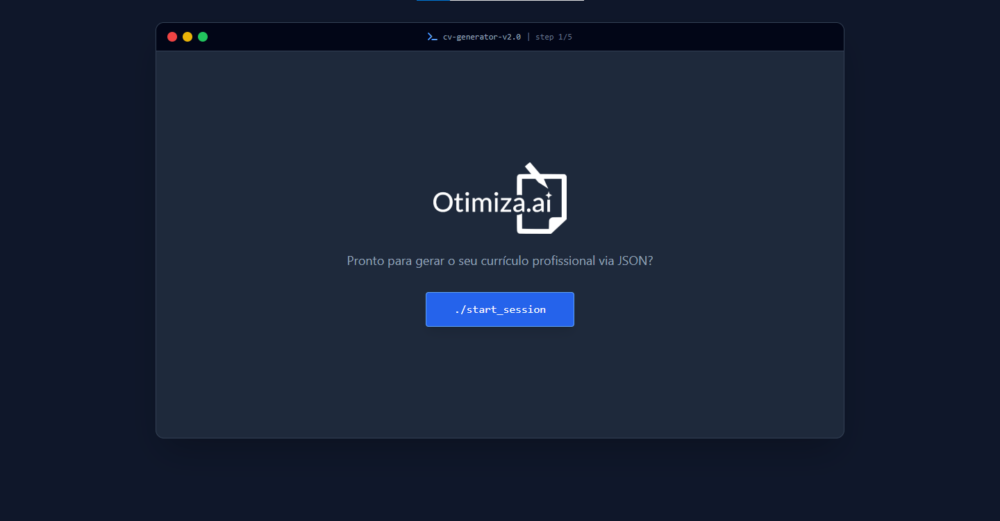

# Otimiza.ai - Gerador de Currículos em HTML a partir de JSON


Este projeto oferece uma ferramenta simples e eficiente para gerar currículos formatados em HTML, prontos para impressão ou para serem salvos como PDF, a partir de uma estrutura de dados JSON. O sistema é otimizado para compatibilidade com ATS (Applicant Tracking Systems) e permite fácil personalização visual.

## Funcionalidades

- **Input de JSON:** Interface intuitiva para colar a estrutura JSON do seu currículo.
- **Geração Dinâmica de HTML:** Transforma o JSON em um currículo HTML bem estruturado e visualmente limpo.
- **Otimização para ATS:** A estrutura do currículo gerado segue as melhores práticas para ser facilmente lida e processada por sistemas de rastreamento de candidatos.
- **Estilo Minimalista:** Design em preto e branco com espaçamento compacto para máxima legibilidade e profissionalismo.
- **Links Visíveis:** Todos os links (email, LinkedIn, GitHub, etc.) são formatados em azul para fácil identificação.
- **Impressão e PDF:** Funcionalidade para imprimir o currículo diretamente do navegador ou salvá-lo como PDF, com o nome do candidato no título do arquivo.
- **Cópia de HTML:** Opção para copiar o HTML gerado para uso em outras plataformas.
- **Títulos de Seção Visíveis na Impressão:** Os títulos de cada categoria do currículo (Objetivo, Experiência, Habilidades, etc.) são exibidos tanto na prévia quanto na impressão.



## Novidades 

- **Design de Interface Tech:** A ferramenta agora roda sob uma interface imersiva inspirada em ambientes de desenvolvimento (IDE / Terminal macOS), trazendo modo escuro e navegação orientada a passos.
- **5 Temas para o Currículo:** Escolha entre 5 temas diferentes para maior personalização do seu currículo
- **Suporte para currículos em inglês:** Gere currículos em inglês ou português por meio da mesma estrutura JSON

## Como Usar

Para utilizar o gerador de currículos, siga os passos abaixo:

1. **Clone ou Baixe o Projeto:** Obtenha os arquivos `index.html`, `style.css` e `script.js`.
2. **Abra o index.html:** No seu navegador de preferência (Google Chrome, Mozilla Firefox, Microsoft Edge, etc.), abra o arquivo `index.html`.
3. **Insira o JSON:** No campo de texto fornecido, cole a estrutura JSON do seu currículo. Certifique-se de que o JSON esteja válido.
4. **Gerar Currículo:** Clique no botão "Gerar Currículo". A prévia do seu currículo será exibida imediatamente abaixo.
5. **Imprimir / Salvar como PDF:** Para imprimir o currículo ou salvá-lo como PDF, clique no botão "Imprimir / Salvar como PDF". A caixa de diálogo de impressão do seu navegador será aberta, permitindo que você escolha as opções desejadas.
6. **Copiar Texto do Currículo:** Se precisar do texto do currículo gerado, clique em "Copiar Texto do Currículo". Uma mensagem de confirmação aparecerá.
7. **Limpar:** Para remover o JSON do campo de texto e a prévia do currículo, clique no botão "Limpar".

## Prompt Recomendado para a IA

```
Você é um especialista em recrutamento tech. Eu vou te fornecer as minhas informações profissionais. Quero que você preencha o modelo JSON abaixo com os meus dados. Não modifique a estrutura do JSON original. Resuma onde for necessário para ficar objetivo e profissional. Retorne APENAS o bloco de código JSON, sem textos adicionais antes ou depois.

[COLE O JSON DO SISTEMA AQUI]

Meus dados: [COLE SEUS DADOS, TEXTOS OU CURRÍCULO ANTIGO AQUI]
```

## Estrutura do JSON

A seguir, a estrutura JSON esperada pelo sistema para a correta geração do currículo. É fundamental que os campos e a hierarquia sejam respeitados para que o currículo seja renderizado corretamente. Você pode pedir para uma ferramenta LLM gerar o currículo com as informações desejadas.

```
{
  "name": "Fulano da Silva",
  "title": "Desenvolvedor Backend | Python & Go",
  "contact": {
      "location": "São Paulo, SP",
      "phone": "(11) 99999-9999",
      "whatsapp": "(11) 99999-9999",
      "email": "fulano.dev@email.com",
      "linkedin": "linkedin.com/in/fulano",
      "github": "github.com/fulano"
  },
  "objective": "Desenvolvedor focado em escalabilidade e arquitetura de microsserviços.",
  "experience": [
      {
          "company": "Tech Solutions",
          "role": "Sênior Backend Developer",
          "period": "2020 - Presente",
          "description": "Liderança técnica na migração de monolito para microsserviços usando Go e AWS."
      }
  ],
  "projects": [
      {
          "name": "Sistema de Gestão de APIs",
          "github": "https://github.com/fulano/api-manager",
          "tech": ["Go", "Redis", "Docker"],
          "description": "Gateway de API de alta performance capaz de processar 10k requisições por segundo."
      },
      {
          "name": "Bot de Automação de Trading",
          "github": "https://github.com/fulano/trading-bot",
          "tech": ["Python", "Pandas", "Binance API"],
          "description": "Algoritmo de trading baseado em análise técnica para criptomoedas."
      }
  ],
  "education": [
      {
          "institution": "Universidade de São Paulo",
          "degree": "Ciência da Computação",
          "period": "2014 - 2018"
      }
  ],
  "technical_skills": {
      "linguagens": [
            "Python",
            "JavaScript",
            "SQL",
            "HTML",
            "CSS"
        ],
        "frameworks_e_bibliotecas": [
            "Django",
            "Flask",
            "Node.js",
            "React (Básico)",
            "Jinja"
        ],
        "bancos_de_dados": [
            "PostgreSQL",
            "MySQL",
            "MongoDB"
        ],
        "ferramentas_e_metodologias": [
            "Git",
            "Docker (Básico)",
            "VS Code",
            "Jira",
            "Metodologias Ágeis (Scrum)"
        ]
  },
  "languages": {
      "Português": "Nativo",
      "Inglês": "Avançado",
      "Espanhol": "Básico"
  },
  "additional_info": "Disponibilidade para viagens e mudança de cidade.",
  "cover_letter": "Prezada equipe,\n\nEscrevo para expressar meu interesse na posição de desenvolvedor..."
}
```
